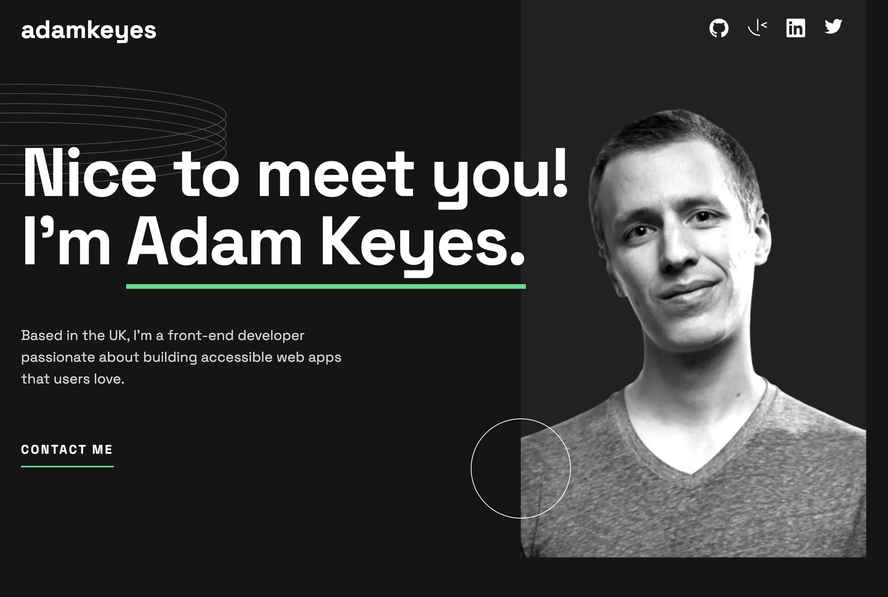

# Single Page Developer Portfolio

### Description

This is a solution to the [Single-page developer portfolio challenge on Frontend Mentor](https://www.frontendmentor.io/challenges/singlepage-developer-portfolio-bBVj2ZPi-x).

### Built With

- Semantic HTML5.
- CSS.
- Vanilla Javascript.
- BEM.

### Links

- GitHub URL: [https://github.com/norrland90/single-page-developer-portfolio]
- Live Site URL: [https://norrland90.github.io/single-page-developer-portfolio]

### Status

Project is: _finished_.

### Contact

Created by [@norrland90](https://github.com/norrland90) - feel free to contact me!
